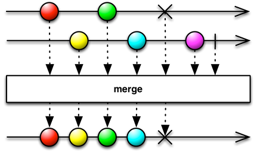

The most convenient way of figuring out what a given operator does (and,
conversely, finding the appropriate operator that will do what you need
in a particular situation) is by looking at **marble diagrams**.

For example, here is the one for the `merge` operator:

[prev](11.md) | [next](13.md)